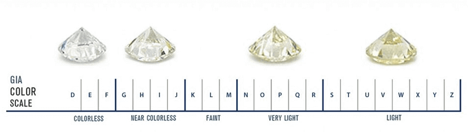
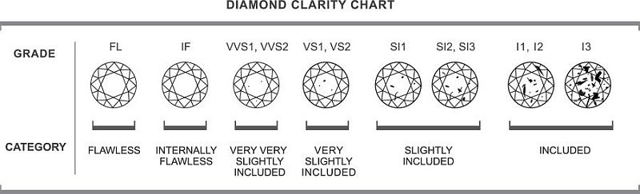

# Project Module 2

The purpose of this repository is to explore a dataset showing the main characteristics and prices of fifty thousand diamonds.

After the exploration, the second objective is to visualize these data and the correlation between them by means of the Matplotlib and Seaborn libraries and the Tableau visualization tool.

Finally, this real sample is compared against data appearing in the literature by means of Hypothesis testing.

## Main topics

- Data Exploration with Pandas library
- Data Visualization using MatPlotlib and Seaborn
- Data Visualization using Tableau
- Hypothesis testing with Scipy library


## Installation

Use the package manager [conda](https://docs.conda.io/projects/conda/en/latest/user-guide/install/) to install libraries in the environment you are executing the notebook. Required libraries are shown  below:

```python
conda install pandas
```

## Usage

**Data Exploration:**

Open the file data_analysis_report.ipynb from ```notebooks``` in your Jupyter terminal or and IDE (i.e. Pycharm). Also contains hypothesis testing.

**Tableau Dashboard:**

## Understanding the dataset

It is important to know some of the features of the diamonds in order to properly understand this dataset.

- Color



- Carat

Diamond Carat Weight Measures a Diamond's Apparent Size

A metric “carat” is defined as 200 milligrams. Each carat is subdivided into 100 'points'. This allows very precise measurements to the hundredth decimal place.

- Dimensions


- Clarity




## References

- [Pandas](https://pandas.pydata.org/pandas-docs/stable/reference/index.html)

- [Matplotlib](https://matplotlib.org/stable/index.html)

- [Seaborn](https://seaborn.pydata.org/)

- [Tableau Public](https://public.tableau.com/s/)

- [Tableau viz of the day](https://public.tableau.com/es-es/gallery/?tab=viz-of-the-day&type=viz-of-the-day)

- [Statistical functions](https://docs.scipy.org/doc/scipy/reference/stats.html)

